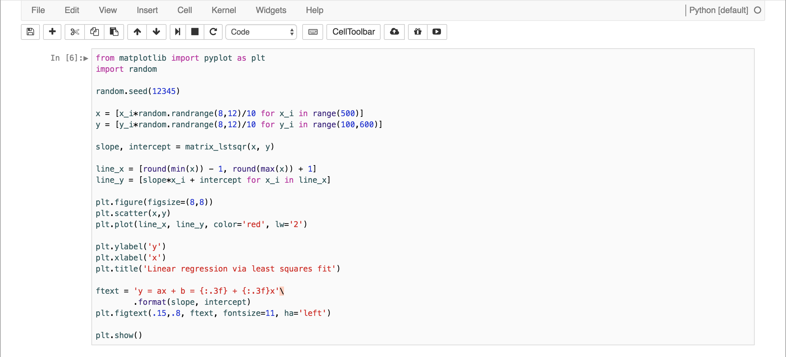

### Jupyter-Notebook-Theme
Personal theme that I use for Jupyter notebooks, modified version of `Neil Panchal`'s scheme (see fork origin). I've basically tried to replicate syntax highlighting in Xcode where possible — with a couple of other minor modifications.

### Installation instructions
https://github.com/nsonnad/base16-ipython-notebook